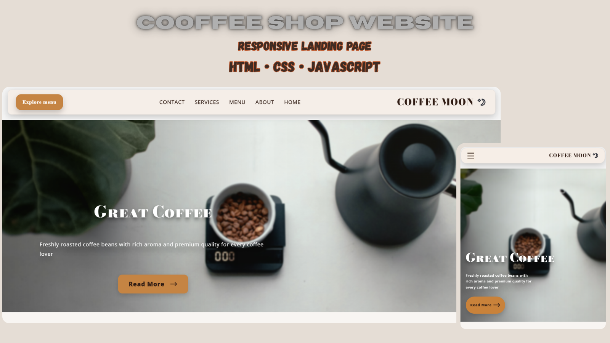
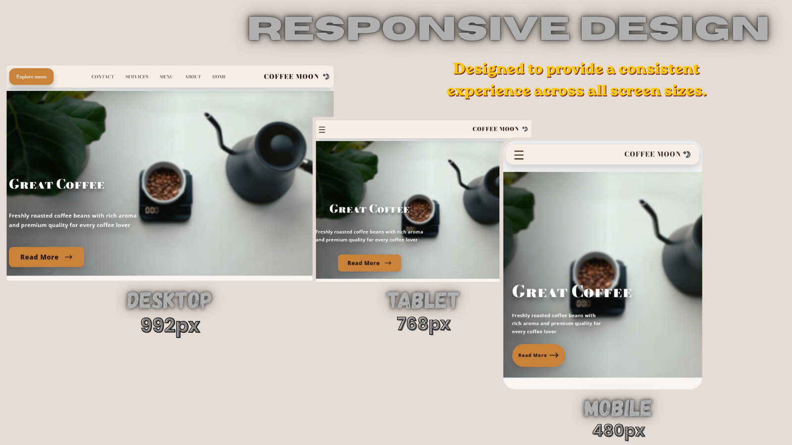
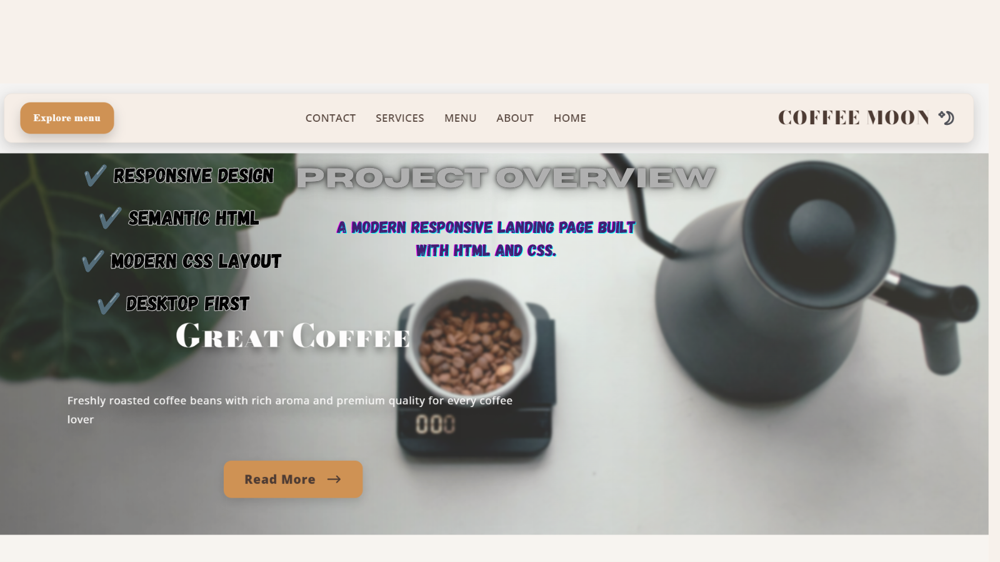
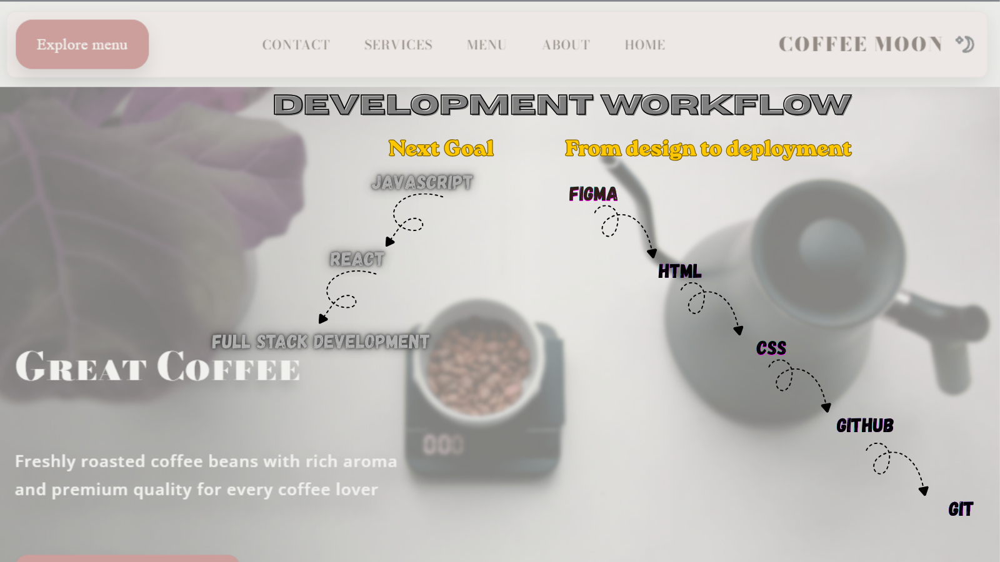

# ☕ Coffee Shop Landing Page

A modern and responsive Coffee Shop Landing Page built with semantic HTML and modern CSS.

This project was created as my first portfolio project to practice turning a Figma design into a real, responsive website while following a Git-based development workflow.

---


## 🌐 Live Demo

> https://YOUR-GITHUB-PAGES-LINK

---

## 📸 Project Preview



---

## 📖 About The Project

The goal of this project was not simply to build a landing page.

Instead, it was an opportunity to practice the complete front-end development workflow, including:

- Planning the project
- Converting a Figma design into code
- Writing semantic HTML
- Building responsive layouts with CSS
- Managing the project using Git and GitHub
- Preparing a professional GitHub repository

This project represents an important milestone in my learning journey as I move toward JavaScript, React, and modern front-end development.

---

## ✨ Features

- Responsive Design
- Semantic HTML5
- Modern CSS3
- Flexible Layout
- Desktop, Tablet and Mobile Support
- Clean Project Structure
- Git Version Control
- GitHub Pages Deployment

---

## 🛠 Built With

- HTML5
- CSS3
- Git
- GitHub
- Figma
- Canva
- Visual Studio Code

---

## 📱 Responsive Design

The project has been optimized for multiple screen sizes including:

- Desktop
- Tablet
- Mobile



---

## 🖼 Project Overview



---

## ⚙ Development Workflow

The project followed a Git-based workflow throughout development.

- Feature implementation
- Incremental commits
- Repository management with Git
- Deployment using GitHub Pages



---

## 🤖 AI Assistance

Artificial Intelligence was used as a learning and productivity tool during this project.

It helped with:

- Code review
- Learning front-end concepts
- Debugging
- Understanding Git and GitHub workflows
- Improving project structure
- Reviewing responsive layouts

All implementation decisions, project organization, and final code were reviewed, tested, and integrated by me as part of the learning process.

---

## 📚 What I Learned

Throughout this project I practiced:

- Semantic HTML
- Modern CSS
- Responsive Design
- Git & GitHub workflow
- Figma to Code workflow
- Project organization
- Writing cleaner and more maintainable code

More importantly, I learned how to build a complete project from planning to deployment.

---

## 🚀 Future Improvements

This project is intentionally kept focused on HTML and CSS.

Future versions may include:

- JavaScript interactions
- Dark Mode
- Better accessibility
- Improved animations
- Performance optimizations

---

## 📂 Project Structure

```
coffee-shop-landing-page
│
├── assets
│   ├── images
│   └── preview
│
├── index.html
├── style.css
├── README.md
└── .gitignore
```

---

## 🚀 Getting Started

Clone the repository

```bash
git clone https://github.com/sajjadsafavi/coffee-shop-landing-page.git
```

Open the project folder and run `index.html` in your browser.

---

## 👨‍💻 Author

**Mehrad Safavi**

GitHub:
https://github.com/sajjadsafavi

This project marks the beginning of my front-end development portfolio as I continue learning JavaScript and React.